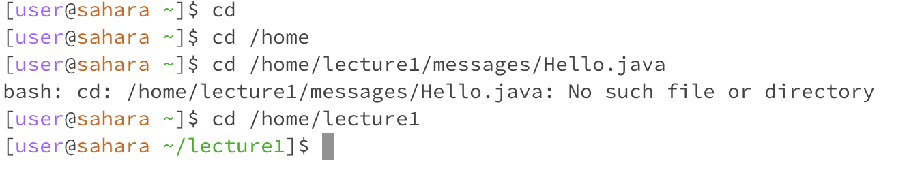
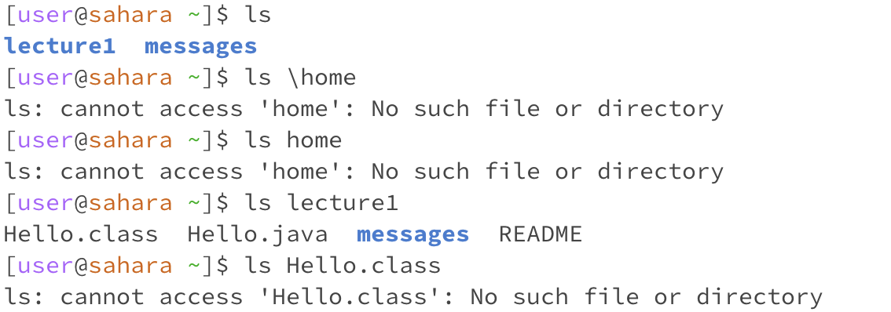
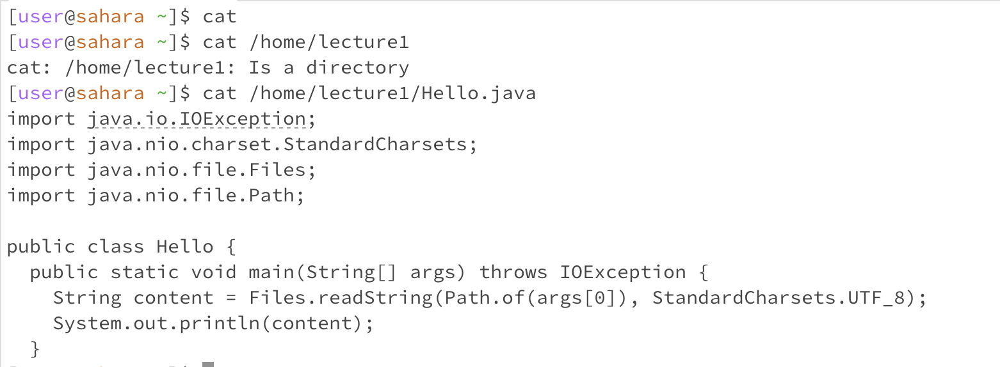

# **Lab Report 1**
1. ## `cd` Examples
   
    * `cd` with no arguments didn't do anything because that means we're not in any directory so there's nothing to display. This didn't give an error.
    * With a path given to lecture1 `cd` took us to that folder, and displayed the folder we were in. This didn't give an error.
    * However given a path to a file, it showed an error that the there was no such file. This is probably because I inputted the path to the file incorrectly.
2. ## `ls` Examples
     
     * With no arguments `ls` listed the folders within the "home" directory. There was no error.
     * With the path to "lecture1" as an argument, it listed the files and folders within lecture1. This didn't cause an error.
     * But with a path to a file within "lecture1" ls couldn't access it, and an error popped up, probably since there were no other files to be listed within that file.
3. ## `cat` Examples
     
      * With no arguments `cat` didn't do anything, probably because it had nothing to display
      * With a correct path to a folder `cat` printed out the path to the folder and also prints out "Is a directory" to tell us the path we inputted is valid. There was no error
      * With a correct path to a file, the contents of that file are printed out in full. There was no error.

