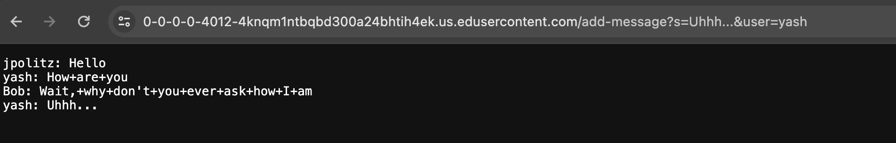
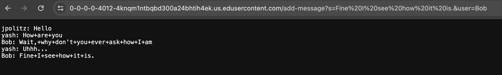
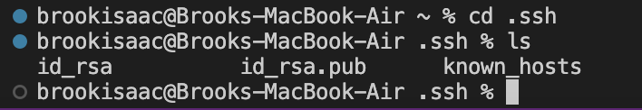
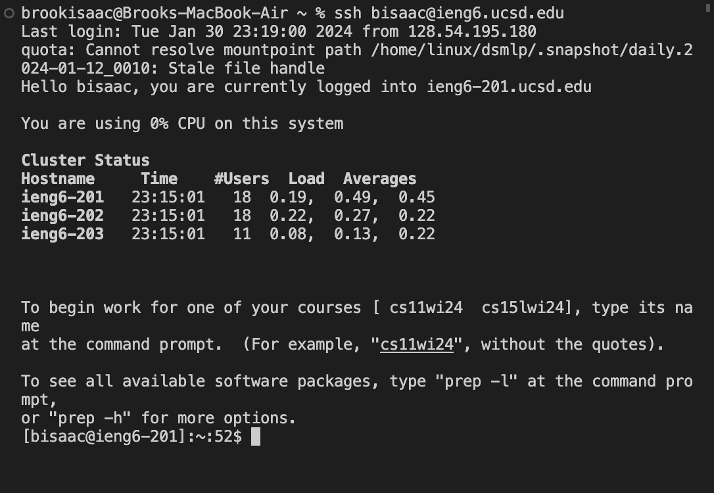

# **Lab Report 2**
## Part 1
Here is the code for my Chat Server:
```
import java.io.IOException;
import java.net.URI;

class Handler implements URLHandler {
    
    String s = "";

    public String handleRequest(URI url) {
        if (url.getPath().equals("/")) {
            return s;
        } else {
            if (url.getPath().contains("/add-message")) {
                String[] parameters = url.getQuery().split("&");
                String[] sParameters = parameters[0].split("=");
                String[] userParameters = parameters[1].split("=");
                if (userParameters[0].equals("user")) {
                    s = s + userParameters[1] + ": ";
                }
                if(sParameters[0].equals("s")){
                    s = s + sParameters[1] + "\n";
                }
                return s;
            }
            return "404 Not Found!";
        }
    }
}

class ChatServer {
    public static void main(String[] args) throws IOException {
        if(args.length == 0){
            System.out.println("Missing port number! Try any number between 1024 to 49151");
            return;
        }

        int port = Integer.parseInt(args[0]);

        Server.start(port, new Handler());
    }
}
```
And here are some of examples of outputs using `/add-message`:
Note: The following is assuming the server has already been started and a port number has been inputted
 
* The handleRequest method is being called here when a url is typed in the entry box
* In this `String s` already has information stored to it from previous entries of `/add-message` so s before the method is called is equal to...
  
        ```
        jpolitz: Hello
        yash: How+are+you
        Bob: Wait,+why+don't+you+ever+ask+how+I+am
        ```
  
* Now once the method is invoked it goes through the and searches for `/add-message` keyword.
* If that is found, it ensures the query is in the right format, and then splits the query into two strings. One for the input string, and one for the user. This is what's stored in `parameters`. (Note: these are split by `&` keyword)
* The strings in `parameters[0]` and `parameters[1]` are split again to distinct the inputs from the variable names (Note: these are seperated by `=`) Now these inputs were used to format the string properly to output `String s`
 
* A lot of the process for this next example was the same as above except the `String s` was updated with the addition of `yash: Uhhh...` also parameters will change according to the query for this example.
* One thing to note is that if the query keywords and characters aren't found, whether it's for inputting a user or splitting the inputted query the output of the webpage will be the error message
    
## Part 2
The absolute path to the private key for my SSH key for logging into ieng6: /Users/brookisaac/.ssh/id_rsa and /Users/brookisaac/.ssh/id_rsa.pub

* As shown above, both keys are under my username, and within the .ssh folder
* And having this key in my computer allows me to login to my ieng6 account without a password as you will see below...
  

## Part 3
I learned how to use ssh to login to local servers that I have access to. I also learned how to run a server in java, and how a query allows you to manipulate what you see on a webpage just through the url. I learned that url are basically treated as strings, and the backslashes and question marks just break up these actions into something that is readable by a program. And I'm generally getting a bit more comfortable navigating the files in my computer.

