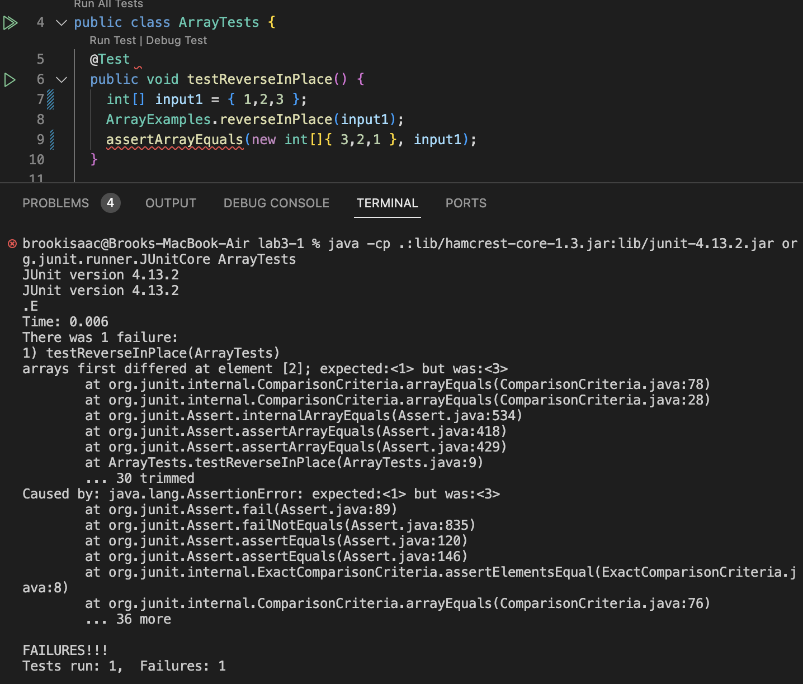
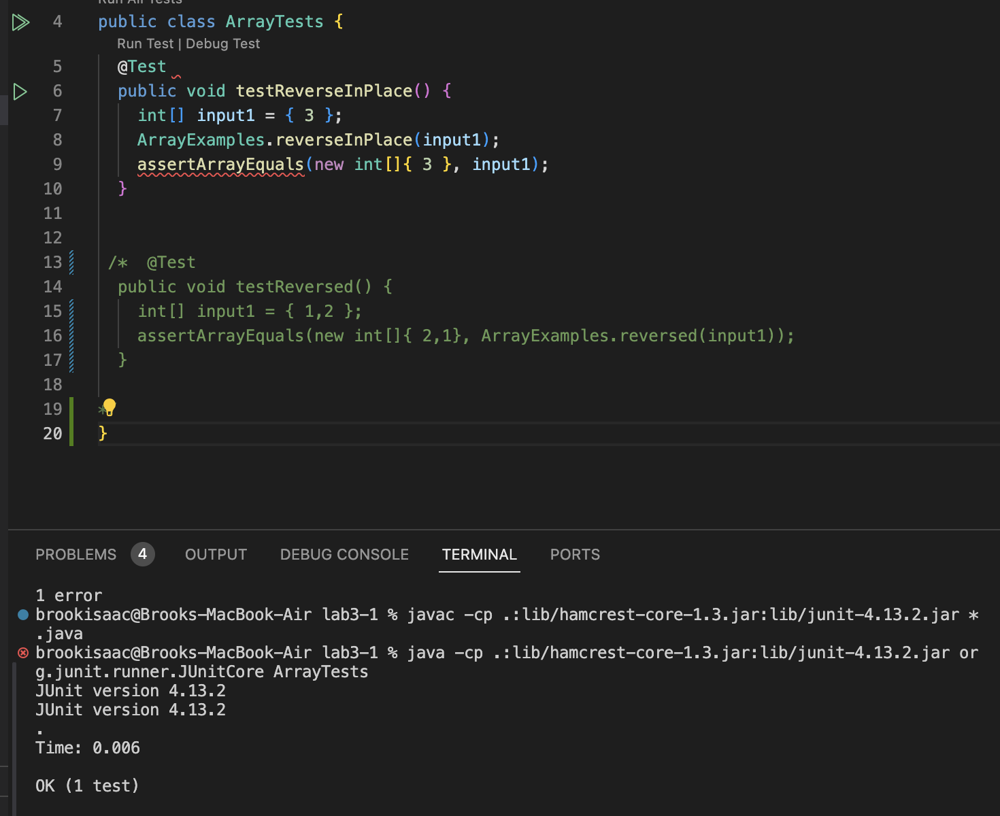

# **Lab Report 3**
## Part 1
For part one of this lab I will be testing the `ArrayExamples.reverseInPlace(int[] input)` method and here is the buggy code for said method:
```
static void reverseInPlace(int[] arr) {
    for(int i = 0; i < arr.length; i += 1) {
      arr[i] = arr[arr.length - i - 1];
    }
  }
```
**A failure inducing input**
* Inputting the array `{1,2,3}` gave an assertion error of `arrays first differed at element [2]; expected:<1> but was:<3>` , here is the code of the test:
  ```
  @Test 
	public void testReverseInPlace() {
    int[] input1 = { 1,2,3 };
    ArrayExamples.reverseInPlace(input1);
    assertArrayEquals(new int[]{ 3,2,1 }, input1);
	}
  ```
  
**Succesful input**
* Inputting an array with a single element such as `{3}` didn't return an error, here is the code of the test:
  ```
  @Test 
	public void testReverseInPlace() {
    int[] input1 = { 3 };
    ArrayExamples.reverseInPlace(input1);
    assertArrayEquals(new int[]{ 3 }, input1);
	}
  ```
  
**Code Change**
  * Here is what I changed the initial code to in the `ArrayExamples.reverseInPlace(int[] input)` method to fix the bugs
  ```
  static void reverseInPlace(int[] arr) {
    for(int i = 0; i < arr.length/2; i += 1) {
      int temp;
      temp = arr[i];
      arr[i] = arr[arr.length - i - 1];
      arr[arr.length - i - 1] = temp;
    }
  }
  ```
  * This fixed the issue, because initially when the array got to the last element, it couldn't swap with the first since it was already changed to the last element. However with the introduction of a temp int type variable we can store the number seperately to swap each position without a loss of information.

## Part 2
The command I will be focusing on is `find`, and the four command options I will explore are `-name`, `-type`, `-size` and `-and`, the source I used to find all these command options is: https://tecadmin.net/linux-find-command-with-examples/
* The `-name` command option takes in either a pattern or a specific file name as an argument and it outputs the files that matches that pattern/name. This is useful since we can narrow down the files we want to see when handling a lot of files. Here are a couple examples of it in use:
  * Example 1
  ```
  brookisaac@Brooks-MacBook-Air docsearch-1 % cd technical
  brookisaac@Brooks-MacBook-Air technical % ls   
  911report       biomed          government      plos
  brookisaac@Brooks-MacBook-Air technical % find biomed/ -name '*.txt'
  biomed//1472-6807-2-2.txt
  biomed//1471-2350-4-3.txt
  biomed//1471-2156-2-3.txt
  biomed//1471-2156-3-11.txt
  biomed//1471-2121-3-10.txt
  biomed//1471-2172-3-4.txt
  biomed//gb-2002-4-1-r2.txt
  ```
  * Example 2
    ```
    brookisaac@Brooks-MacBook-Air technical % find biomed/ -name 'bcr567.txt'
    biomed//bcr567.txt
    ```
*The `-type` command option takes in either `f`, `l` or `d` as options `f` stands for file type, `l` stands for symbiolic links type, and `d` stands for directory type. This is useful only if you have multiple types in one folder, however, I don't think that's very common.
  * Example 1
    ```
    brookisaac@Brooks-MacBook-Air technical % find plos/ -type l
    ```
    For this input there was no output since there are no symbolic link type files in this directory
  * Example 2
    ```
    brookisaac@Brooks-MacBook-Air technical % find plos/ -type f
    plos//pmed.0020273.txt
    plos//journal.pbio.0030032.txt
    plos//pmed.0020065.txt
    plos//pmed.0020071.txt
    plos//pmed.0020059.txt
    plos//pmed.0010039.txt
    plos//journal.pbio.0020354.txt
    plos//pmed.0010010.txt
    plos//journal.pbio.0020156.txt
    plos//pmed.0020104.txt
    plos//pmed.0020272.txt
    plos//pmed.0020258.txt
    plos//pmed.0020099.txt
    ```
*The `size` command option in `find` takes in a file size as an argument, it can find files less than, greater than or exactly equal to the inputted file.
  * Example 1
    ```
    brookisaac@Brooks-MacBook-Air technical % find plos/ -size -5k
    plos//pmed.0020273.txt
    plos//pmed.0020065.txt
    plos//pmed.0020258.txt
    plos//pmed.0020113.txt
    plos//pmed.0020275.txt
    plos//pmed.0020117.txt
    plos//pmed.0020116.txt
    plos//pmed.0020274.txt
    plos//pmed.0020048.txt
    ```
  * Example 2
    ```
    brookisaac@Brooks-MacBook-Air technical % find plos/ -size +5k  
    plos/
    plos//journal.pbio.0030032.txt
    plos//pmed.0020071.txt
    plos//pmed.0020059.txt
    plos//pmed.0010039.txt
    plos//journal.pbio.0020354.txt
    plos//pmed.0010010.txt
    plos//journal.pbio.0020156.txt
    plos//pmed.0020104.txt
    plos//pmed.0020272.txt
    plos//pmed.0020099.txt
    plos//journal.pbio.0020140.txt
    plos//journal.pbio.0020183.txt
    plos//journal.pbio.0020430.txt
    plos//journal.pbio.0020394.txt
    plos//journal.pbio.0020431.txt
    plos//journal.pbio.0020419.txt
    ```
* The `-and` command option in `find` is super useful because it allows us to narrow down our search even more and combine two or more search options in find so it finds files that satisfies both constraints
  * Example 1
    ```
    brookisaac@Brooks-MacBook-Air technical % find plos/ -size -5k -and -type f -and -name '*.txt'
    plos//pmed.0020273.txt
    plos//pmed.0020065.txt
    plos//pmed.0020258.txt
    plos//pmed.0020113.txt
    plos//pmed.0020275.txt
    plos//pmed.0020117.txt
    plos//pmed.0020116.txt
    plos//pmed.0020274.txt
    plos//pmed.0020048.txt
    plos//pmed.0020074.txt
    ```
    *Example 2
    ```
    brookisaac@Brooks-MacBook-Air technical % find plos/ -size -3k -and -name '*.txt'             
    plos//pmed.0020048.txt
    plos//pmed.0020074.txt
    plos//pmed.0010029.txt
    plos//pmed.0010067.txt
    plos//pmed.0020028.txt
    plos//pmed.0020027.txt
    plos//pmed.0020191.txt
    ```
