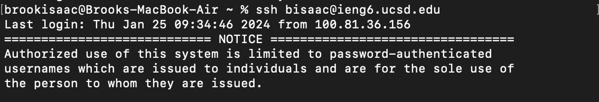
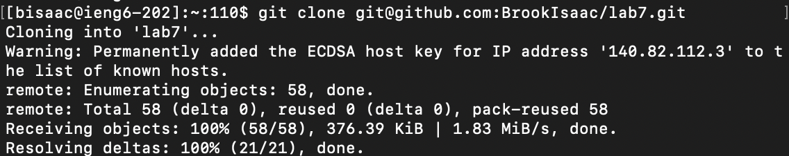

# Lab Report 4
## Step 1: Log into ieng6
* To log into ieng6 I typed in the command `ssh bisaac@ieng6.ucsd.edu` and pressed `<enter>`.
  This automatically signed me into the server since I already have my password saved in my
  workspace.
  
## Step 2: Clone your fork of the repository from your Github account
* I typed in the command `git clone` in the terminal, used `Cmd + C` to copy the ssh URL of the
  repo from my Github account, and `Cmd + V` to paste in the terminal so this gives the command
  `git clone git@github.com:BrookIsaac/lab7.git` then `<enter>` to execute
  
## Step 3: Run the tests, demonstrating that they fail
* First I type `ls` then `<enter>` with `/home` as the current directory, to see what files I'm
  working with. Then `cd lab7` and `<enter>` since I know that's the file cloned from Github, so
  I `ls` with `/lab7` and `<enter>` as the working directory to view the java files I'm working with, and decide
  to use the test.sh file to run the tests by typing in `bash test.sh` and `<enter>`.
  
## Step 4: Edit the code file to fix the failing test
* To edit I use the vim text editor by typing `vim ListExamples.java` and `<enter>` this opens up the java file in
  the terminal. Then I enter insert mode to edit the file by pressing `i`, and in insert mode I was able to use my
  mouse to place the text cursor at line 42 (where the suspected bug was) and I changed `index1` on line 42 to `index2`.
  To save the changes I exited insert mode by clicking `<esc>` and typed in `:w` then `<enter>` to save, and `:q` and
  `<enter>` to quit.
  
## Step 5: Run the tests, demonstrating that they now succeed
* To rerun the tests I again typed the command `bash test.sh` and `<enter>`
  
## Step 6: Commit and push the resulting change to your Github account
* To commit I first had to type the command `git add ListExamples.java` and `<enter>` to specify
  the changes and files I want to add to the staging area. Then `git commit -m "Changes saved` and `<enter>` to save those
  changes to the local repository. Now I type the command `git push origin main` and `<enter>` to push the changes made
  in the local repository (defaultly called `origin`) to the remote repository called `main`.
  
  
