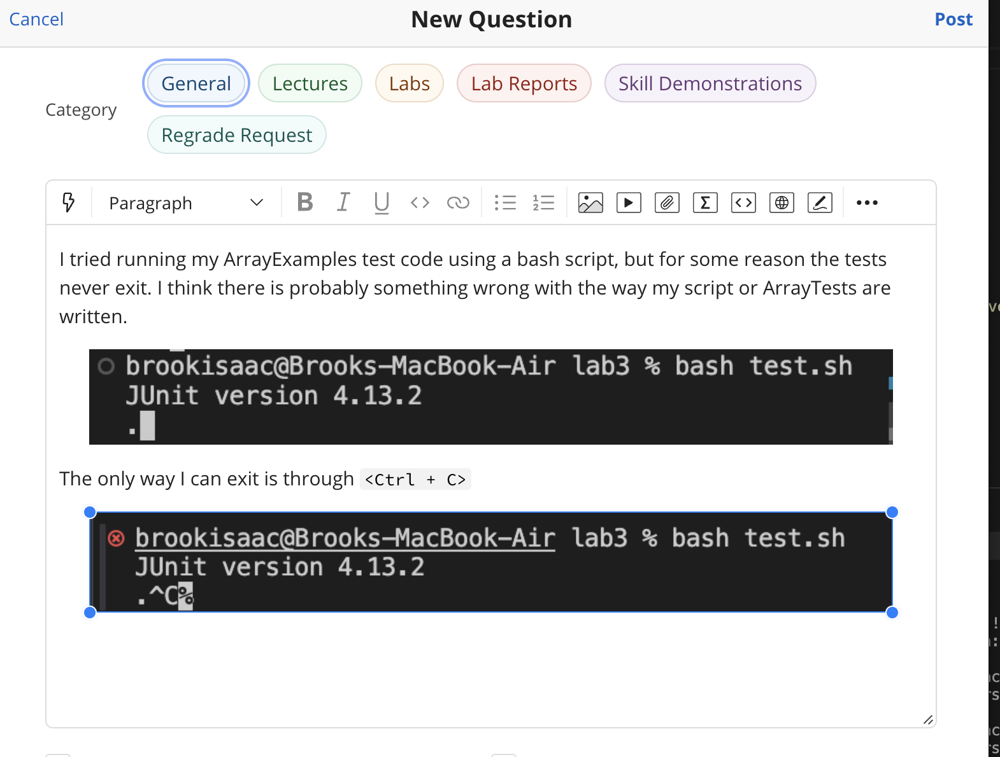

# Lab Report 5
## Part 1: Debugging Scenario
1. Original EdStem Post
   * 
2. TA Response: I doubt the test, or array tests can produce an error that leads to a code not exiting. Have you checked your main code file? Typically, code that doesn't exit is a result of an infinite loop not letting your code terminate. Can you look over your main code, are there any errors in your loops?
3. Looking through the loops of their main code, the student was able to catch that the error was in the `reverseInPlace` function, and they had left out the third statement in their `for` loop. This caused the index `i` to never be incremented, hence `i` was always equal to 0 and never greater than `arr.length/2` so the loop never ended. And this caused the tests to never end as well.  This was interesting behavior because the student had expected a syntax error to show up, not allowing the code to compile, but instead it actually did. So although it was a simple slip up, and "syntax error" it shows that not all issues with syntax are caught with the compiler leading the code to have unexpected behavior. And these errors, particularly in larger code bases are harder to find.
4. More supporting information about the error
   * File and Directory structure
   * File contents prior to fixing the bug
  
