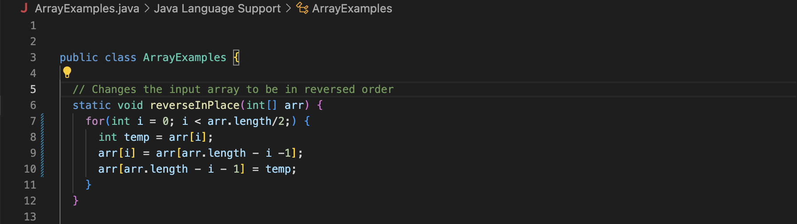
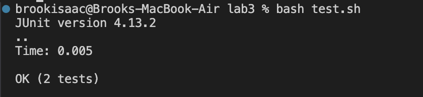
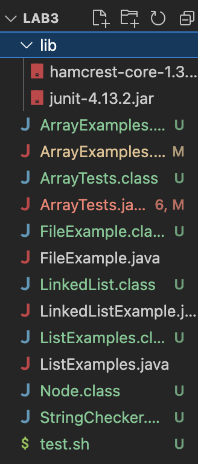
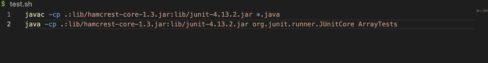
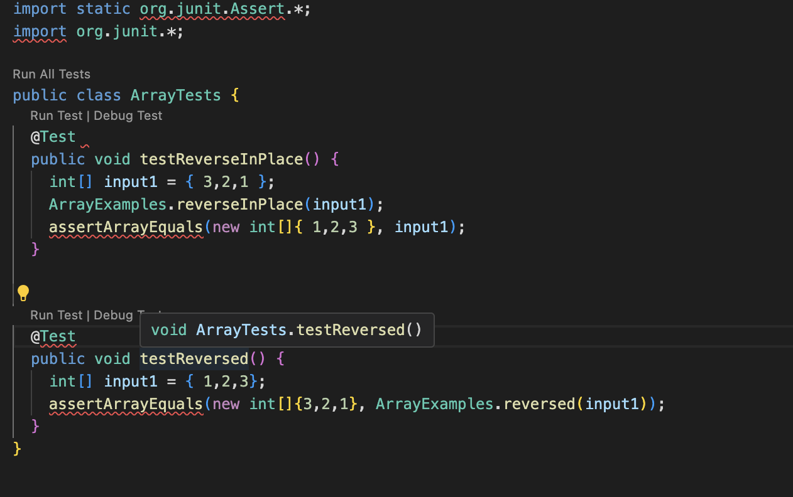

# Lab Report 5
## Part 1: Debugging Scenario
1. **Original EdStem Post**
   * 
2. **TA Response:**
   * I doubt the test, or array tests can produce an error that leads to a code 
     not exiting. Have you checked your main code file? Typically, code that 
     doesn't exit is a result of an infinite loop not letting your code 
     terminate. Can you look over your main code, are there any errors in your 
     loops?
3. **Code That Student Looked Over**
   * 
   * Looking through the loops of their main code, the student was able to catch          that the error was in the `reverseInPlace` function, and they had left out the       third statement in their `for` loop in line 7. This caused the index `i` to          never be incremented, hence `i` was always equal to 0 and never greater than         `arr.length/2` so the loop never ended. And this caused the tests to never end       as well.  This was interesting behavior because the student had expected a           syntax error to show up, not allowing the code to compile, but instead it            actually did. So although it was a simple slip up, and "syntax error" it shows       that not all issues with syntax are caught with the compiler leading the code        to have unexpected behavior. And these errors, particularly in larger code           bases are harder to find.
   * Terminal output after code fixed issue:
     
4. **More supporting information about the error**
   * File and Directory structure
     
   * File contents prior to fixing the bug
     * Test.sh file
       
     * ArrayTests.java file
       
## Part 2: Reflection
The coolest thing I learned was defintely doing all the commands, and editing texts through the terminal using vim, and learning how much control we have over the files throgh the terminal. It felt like I unlocked a lot of what we can do in terms of file manipulation, these are definetly useful skills that I will be using plenty of times in other classes. That's what I've liked about this class, I'm definetly more comfortable navigating my way through my pc after it.
  
